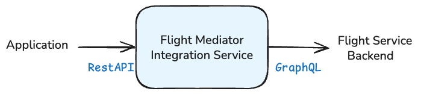
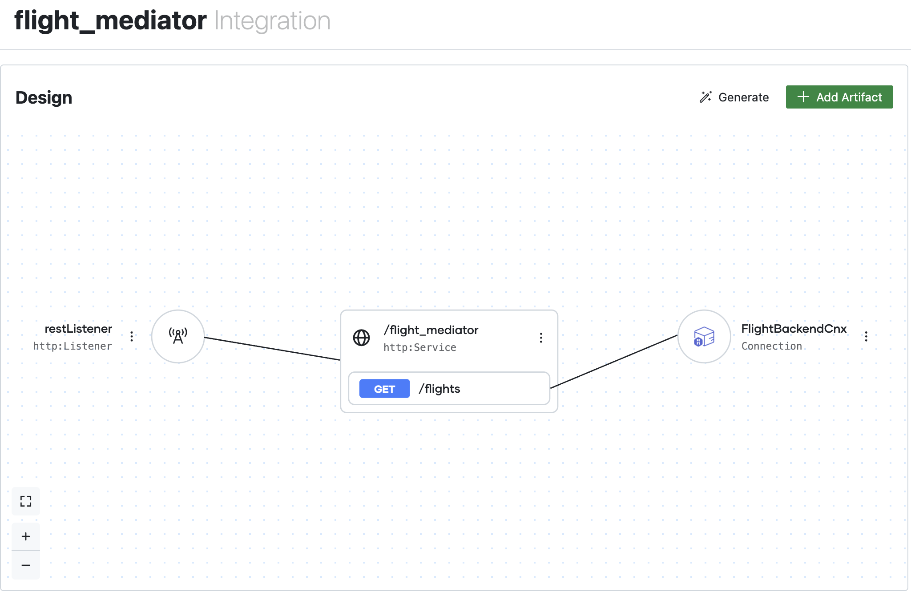

# Flight Mediator Service

The purpose of this sample is to demonstrate a ballerina integration service acting as a mediation Layer to search flights based on searching criteria like company, departure/arrival airport.

## Overview

This service exposes a simple REST API that internally communicates with a GraphQL backend service to retrieve flight information. It's designed for demonstration purposes with a simplified data structure and minimal error handling.



_A mock Flight GraphQL service will be used for testing purposes_

Searches for flights based on the provided criteria.

**Endpoints:**
GET /flight_mediator/flights

**Parameters:**
- `companyId` (string, required): Airline operator code (e.g., "AF", "LH")
- `boardPoint` (string, required): Departure airport code (e.g., "CDG", "JFK")
- `offPoint` (string, required): Arrival airport code (e.g., "LAX", "LHR")
- `departureDateFrom` (string, required): Start date for departure search (currently not used in GraphQL query)
- `departureDateTo` (string, required): End date for departure search (currently not used in GraphQL query)

## Run the Service

### Prerequisites
- Install WSO2 Integrator (https://bi.docs.wso2.com/get-started/install-wso2-integrator-bi/)

### Start the Flight Service Mock Service (GraphQL)
```bash
cd flight_graphql_mock
bal run
```

The mock will start a GraphQL Server on port 9091 and be used by the Flight Mediator for testing purposes.

### Start the Flight Mediator Service
```bash
cd ../flight_mediator
bal run
```

The service will start a REST service on port 9090.
The service exposes the following endpoint:
* GET /flight_mediator/flights

### Test the Service
```bash
curl "http://localhost:9090/flight_mediator/flights?companyId=AeroVoyage&boardPoint=ORY&offPoint=LAX&departureDateFrom=2024-01-15&departureDateTo=2024-01-16"
```

Output:
**Example Response:**
```json
[
  {
    "flightId": "AF1234",
    "operator": "AeroVoyage",
    "status": "On Time",
    "departure": {
      "airport": "CDG",
      "scheduledTime": "2024-01-15T10:30:00Z"
    },
    "arrival": {
      "airport": "JFK",
      "scheduledTime": "2024-01-15T14:45:00Z"
    }
  }
]
```

### Example of query

You can refer to the value [Mock](./flight_graphql_mock//README.md) to test several combination

Example 1: Paris CDG to New York JFK from SkyWings Airlines
```bash
curl "http://localhost:9090/flight_mediator/flights?companyId=SkyWings%20Airlines&boardPoint=CDG&offPoint=JFK&departureDateFrom=2024-01-15&departureDateTo=2024-01-16"
```
Example 2: Orly to Los Angeles from AeroVoyage
```bash
curl "http://localhost:9090/flight_mediator/flights?companyId=AeroVoyage&boardPoint=ORY&offPoint=LAX&departureDateFrom=2024-01-15&departureDateTo=2024-01-16"
```

## Change Port configuration

Edit the Config.toml for each project and change the following value:
```
# Rest Port Configuration
HttpServicePort = 9090

# Flight GraphQL Service Endpoint
FlightGraphQLService = "http://localhost:9091/graphql"
```

## TODO

Add a step by step low code implementation.


## Disclaimer

All company names, brands, sample data, and scenarios used in this repository are purely fictitious and provided only for demonstration purposes.
Any resemblance to real companies, or data is purely coincidental.