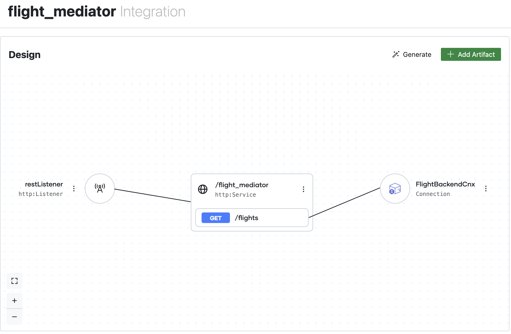

## Step by Step Walkthrough

The following part describe all the steps to redo this implementation


### Step 0. Prerequisites
Install WSO2 Integrator (https://bi.docs.wso2.com/get-started/install-wso2-integrator-bi/)

### Step 1. Create a new integration project
1. Click on the BI icon on the sidebar.
2. Click on the Create New Integration button.
3. Enter the project name as **flight_mediator**, select location and create the project

### Step 2: Create an HTTP service
1. In the design view, click on the Add Artifact button.
2. Select HTTP Service under the Integration as API category.
3. Select the + Listeners option from the Listeners dropdown to add a new listener.
4. Enter the listener name as **restListener**, 9090 as the port and click on the Save button.
5. Add the service base path as **/flight_mediator** and select the Design from Scratch option as the The contract of the service.
5. Click on the Create button to create the new service with the specified configurations.

### Step 3: Define types
1. Click on the Add Artifacts button and select Type in the Other Artifacts section.
2. Click Import Tab, Select JSON format, name it **Flights** and press Import

```
[
    {
        "flightId": "SW1234",
        "operator": "SkyWings Airlines",
        "status": "On Time",
        "departure": {
            "airport": "CDG",
            "scheduledTime": "2024-01-15T10:30:00Z"
        },
        "arrival": {
            "airport": "JFK",
            "scheduledTime": "2024-01-15T14:45:00Z"
        }
    },
    {
        "flightId": "SW5678",
        "operator": "SkyWings Airlines",
        "status": "Delayed",
        "departure": {
            "airport": "CDG",
            "scheduledTime": "2024-01-15T14:20:00Z"
        },
        "arrival": {
            "airport": "JFK",
            "scheduledTime": "2024-01-15T18:35:00Z"
        }
    }
]
```

3. Click on Artifact and add a new Type
4. Create from Scratch, kind Array name **FlightBackendGraphQLResponse** and Type of the Array **Flights**
5. Redo the same step to create a new Type (Create from Scratch)
6. Create a record, name: **RequestResponse**, add two fields as follow:
   1. version: string
   2. size: int
   3. data: Flights

### Step 4: Create a Data Mapper (To map graphQL response to output response)
1. Add a new Artifact, select Data Mapper
2. Data Mapper Name should be **mapFlightBackendResponse** 
3. Imputs variable should be **FlightBackendGraphQLResponse** and its name myFlights and the output **RequestResponse**
4. Press Create
5. For this sample, we will implement a very simple data mapping as follow:


### Step 5: Create the REST endpoint
1. In the design view, click on the Add Artifact button. The service will have a default resource named greeting with the GET method. Click on the three dots that appear in front of the /flight_mediator service resource and select Edit from the menu.
2. Keep the resource HTTP method as GET.
3. Change the ressources path as flights
4. Add 5 parameters, all of them are string
        - string companyId
        - string boardPoint
        - string offPoint
        - string departureDateFrom
        - string departureDateTo
5. Change the success response code to 200 with Body Type **RequestResponse**
6. Press Save

### Step 6: Make the GraphQL Query toward the Flight backend
1. Click on the /flights endpoint
2. Hover to the arrow after start and click the ➕ button to add a new action to the resource.
3. Add a new connection but pressing Connections + Button
4. Select GraphQL backend
5. Set the URL as "http://localhost:9091/graphql"
6. Set the connection name as **"FlightBackendCnx"** and press Create
7. Select the **"FlightBackendCnx"** connection and click on execute
8. For the Document, it should contains the GraphQL Query, input the following one:

```
string `
        query {
            flights(operator: "${companyId}", boardPoint: "${boardPoint}", offPoint: "${offPoint}") {
                flightId
                operator
                status
                departure {
                    airport
                    scheduledTime
                }
                arrival {
                    airport
                    scheduledTime
                }
            }
        }
    `
```

8. Name of the result: "**myFlightBackendResponse** and the target type is **FlightBackendGraphQLResponse**
9. Click Save

### Step 7: Map the response
1. Hover to the arrow after the previous block and click the ➕ button to add a new action to the resource.
2. Click Map Data
3. Select the Data maper we create in step 4
4. For the parameter select **myFlightBackendResponse** 
5. The result variable name should be **myResponse** and Result Type **RequestResponse**
6. Press Save

### Step 8: Return the result
1. Hover to the arrow after previous block and click the ➕ button to add a new action to the resource.
2. Select Return in the Control section
3. Select the **RequestResponse** and press save
